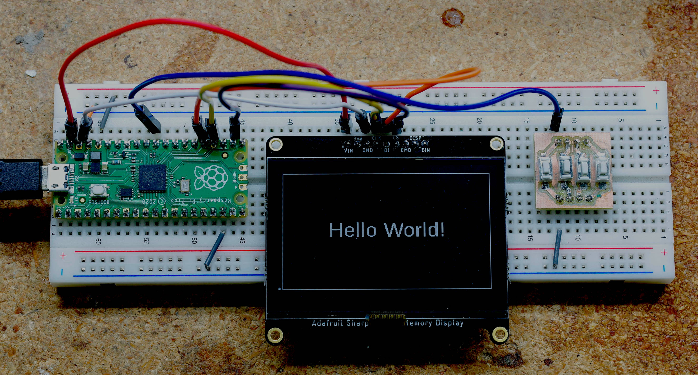
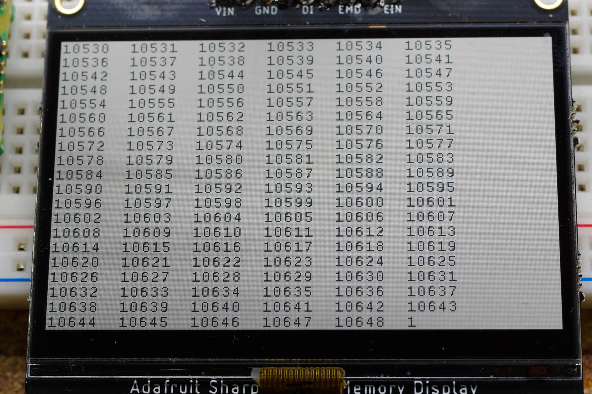
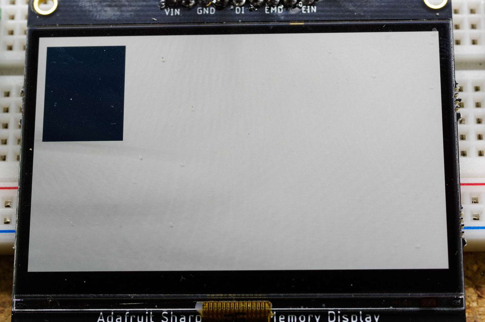
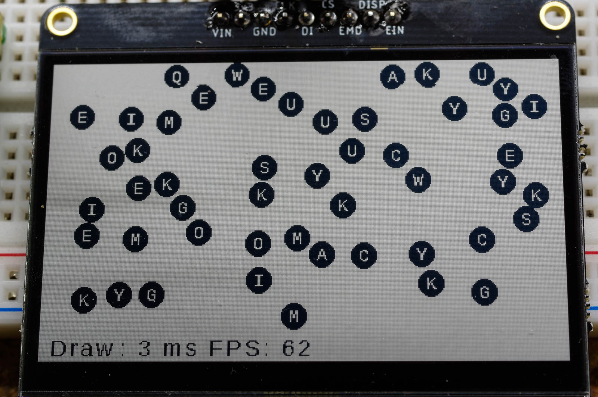
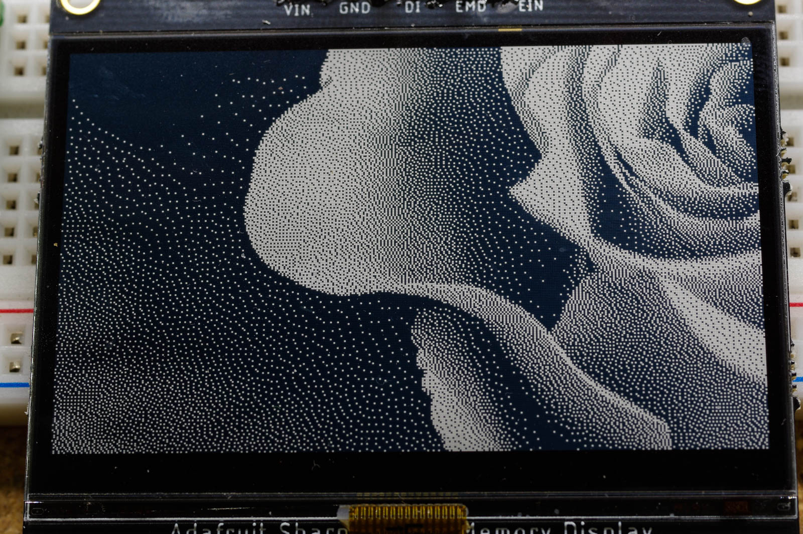
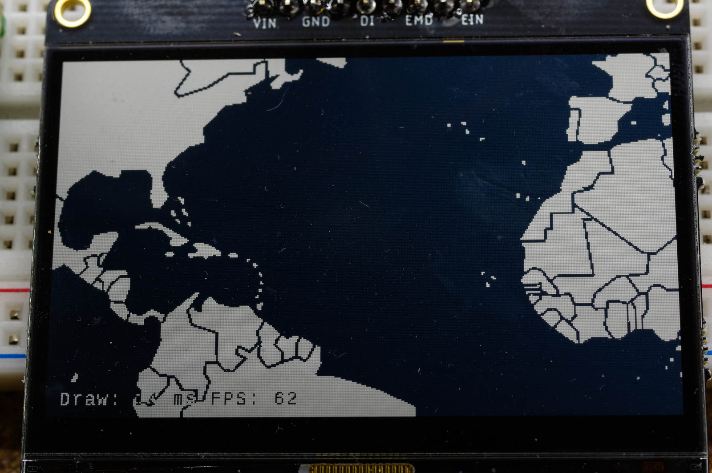
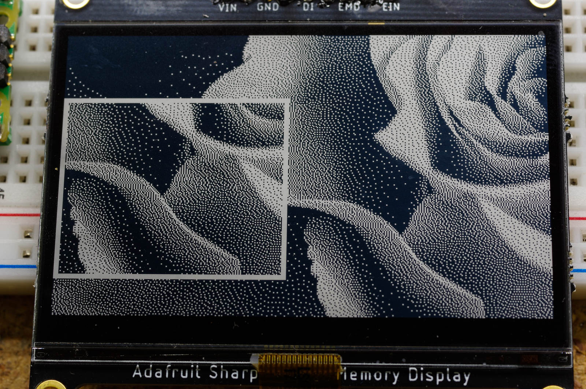
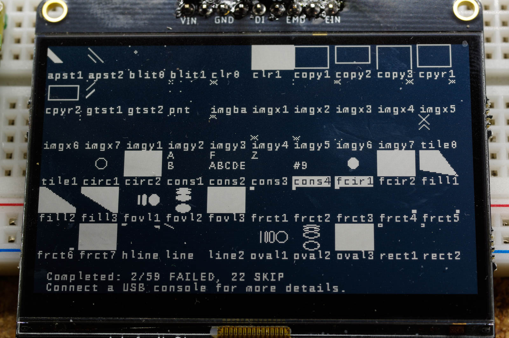

# pico_sharpmem_display

This project is a Raspberry PI Pico library for driving a Sharp Memory Module,
such as the [LS013B4DN04](https://www.adafruit.com/product/3502) or
[LS027B7DH01](https://www.adafruit.com/product/4694).  The library includes low,
mid and high level functions.

*What is a Sharp Memory Display?*

I consider it an evolution of LCD displays - higher contrast and 60FPS animations
with very little ghosting.  Due to it's high contrast, it is often compared to
e-paper (or eink) displays.  Here is a quick comparison:

EPaper Advantages

  * Zero power needed to display a static image (vs around 80 uA for the Sharp)
  * Available in more sizes
  * Color versions are available
  * Potentially cheaper

Sharp LCD Advantages

  * Much less energy needed to *update* an image (around 2,000 times less energy)
  * Much faster updates makes animations practical

# Summary

This library is built on the pico-sdk SPI libraries.  It provides an API with
three conceptual layers:

   * *Low level*: At this level the display is represented as a byte array. 
     You set bytes in the array (each byte represents an 8x1 pixel slice) and
     then call `sharpdisp_refresh()` to see results.  If you are trying to add
     Sharp LCD support to a different graphics library, this is probably the code
     you want to look at.
   * *Mid Level*: Functions for drawing text and simple shapes.
     Examples include `text_str()` from writing a string (with a choice of fonts)
     and `bitmap_circle()` for drawing a circle.
   * *High Level*: At this level, the sharp display is no longer directly
     visible but used lower down.  The one existing example is the `sharpconsole.h`
     library which lets you create and print text to a scrolling console without
     concering yourself with all of the setup code otherwise-needed to get it
     working.

# Project Stability

I would consider this project to be "early beta" at this point.  There is
testing and examples for every API function  but likely still some corner-case
bugs lurking in places.

You are using this library *at your own risk* and are responsible for doing
the appropriate testing and validation to assert it's reliability is
sufficient for your needs.

As an early-beta, I may still make breaking changes to the API.  I suggest
pinning to a release branch if this might be a problem.

# Getting Started - Hello World



## Hardware Connections


Hardware connections are inline with a standard PI Pico SPI device.  The pin
assignments are not fixed and can be changed within the limitations of
the hardware (see [this pinout](https://datasheets.raspberrypi.com/pico/Pico-R3-A4-Pinout.pdf)
for an overview and [the design documentation](https://www.raspberrypi.com/documentation/microcontrollers/raspberry-pi-pico.html) for details)

Here they are:

| PI Pin Name | PI Pin # | LCD Pin Name | LCD Pin # | Notes                        |
|-------------|----------|--------------|-----------|------------------------------|
| VSYS        | 39       | VIN          | 1         | VBUS (40) could also be used |
| GND         | 38       | GND          | 3         | Any PI GND can be used       |
| SPI0 SCK    | 24       | CLK          | 4         |                              |
| SPI0 TX     | 25       | DIN          | 5         | Also called MOSI             |
| SPI0 CSn    | 22       | CS           | 6         |                              |

The button array in the image above is providing a route from the RUN pin to ground.
It can be useful for any project to make loading new firmware more convenient and
is not specific to the Sharp LCD.

## Building Firmware

Here, I assume you are using a Raspberry PI or Linux distro for development and
have already gotten some "blinking light" demo working. From the parent
directory:

```bash
./bootstrap.sh
cd build
cd examples/midlevel/hello_world
make -j
```

> You can also build and run this from Windows or Mac as the build is
> just using the standard PI Pico CMake infrastructure.  Refer to official
> documentation for more details on how to set it up

If all goes to plan, you will now have a `sharpdisp_hello_world.uf2` file
that you can load onto the pico.  You can use the USB drive method or
this command:

```bash
picotool load sharpdisp_hello_world.uf2
```

of course this only works if the Pico is ready to accept code
by holding the boot button on reset or power on.

If the code loads but the image doesn't show, one thing to consider
(along with the usual checking connections) is to lower the SPI
frequency.  Refer to [sharpdisp.h](include/sharpdisp/sharpdisp.h) for guidance on
how to do this (i.e. use `sharpdisp_init_freq_hz()`).

# In-Depth Hello World Analysis

Lets break down an example that uses the API
(located at [examples/midlevel/hello_world/main.c](examples/midlevel/hello_world/main.c)):

```c
#include "pico/stdlib.h"
#include <fonts/liberation_sans_36.h>
#include <sharpdisp/sharpdisp.h>
#include <sharpdisp/bitmapshapes.h>
#include <sharpdisp/bitmaptext.h>

#define WIDTH 400
#define HEIGHT 240

uint8_t disp_buffer[BITMAP_SIZE(WIDTH, HEIGHT)];

int main() {
  sleep_ms(100);  // allow voltage to stabilize

  // Initailize
  struct SharpDisp sd;
  sharpdisp_init_default(&sd, disp_buffer, WIDTH, HEIGHT, 0x00);
  struct BitmapText text;
  text_init(&text, liberation_sans_36, &sd.bitmap);

  // Print Hello World!
  const char* hello = "Hello World!";
  text.x = (WIDTH - text_str_width(&text, hello)) / 2;  // center the string
  text.y = (HEIGHT - text_height(&text)) / 2;
  text_str(&text, hello);

  // Make a border
  const uint16_t border = 15;
  bitmap_rect(
      &sd.bitmap, border, border, WIDTH - border * 2, HEIGHT - border * 2);

  // Send to hardware
  sharpdisp_refresh(&sd);

  while (1) {
    sleep_ms(1000);
  }
}
```

## Hello World - Initialization

### SharpDisp Initialization

```c
uint8_t disp_buffer[BITMAP_SIZE(WIDTH, HEIGHT)];

int main() {
  ...
  struct SharpDisp sd;
  sharpdisp_init_default(&sd, disp_buffer, WIDTH, HEIGHT, 0x00);
  ...
}
```

Note that we need to provide the buffer memory.  Some libraries do this for you
with `malloc()` but use of dynamic memory allocation is debatable on a
resource-limited microcontroller.  Feel free to add a `malloc()` init wrapper
if that is your preference.

`BITMAP_SIZE()` is used to calculate the number of bytes needed.  The
calculation the macro uses is `((WIDTH + 7) / 8) * HEIGHT` where the `+7`
accounts for widths that are not a multiple of 8 pixels.

The last parameter represents the background fill byte.  `0x00` will lead to a
black background while `0xFF` will lead to a white one.  You could use other
values here to make a striped background if you really want to.

Let's look at the `SharpDisp` and `Bitmap` structures a bit:

```c
sharpdisp/sharpdisp.h

struct SharpDisp {
  spi_inst_t *spi;  // choice of SPI hardware
  struct Bitmap bitmap;
  uint8_t cs_pin;  // pin choice for CS
  uint8_t vcom;  // internal state
};
```

Not much in this structure of interest outside of `bitmap` which you will often
need to pass to drawing functions (as `bitmap_rect()` is doing in `main.c` above).

On to `Bitmap`, which is a field of `SharpDisp` but can also be used separately:

```c
sharpdisp/bitmap.h

struct Bitmap {
  uint16_t width;        // width in pixels
  uint16_t width_bytes;  // width in bytes, for buffer calculations
  uint16_t height;       // height in pixels
  uint8_t  mode;         // BITMAP_WHITE, BITMAP_BLACK or BITMAP_INVERSE
  uint8_t  clear_byte;   // 0x00 for black, 0xFF for white
  uint8_t* data;         // contains pixel data
};
```

The `mode` field is used by higher-level drawing functions such as `text_str()`
and `bitmap_rect()` to decide how to draw pixels.  The `clear_byte` field
defines the background "color" to `0x00` (black) `0xFF` (white) or some other
value (for vertical stripes). 

## Hello World - Text Initialization

```c
int main() {
  ...
  struct BitmapText text;
  text_init(&text, liberation_sans_36, &sd.bitmap);
  ...
}
```

Here is the `BitmapText` structure:

```c
sharpdisp/bitmaptext.h


struct BitmapText {
    const uint8_t* font;    // Pointer to some font data
    struct Bitmap* bitmap;  // Pointer to the bitmap to update
    int16_t x;              // Left edge of next drawn character
    int16_t y;              // Top edge of next drawn character
    uint8_t error;          // Non-zero if any errors happen
};
```

The `font` pointer points to a header declared in the [fonts/](fonts) directory.
It is purposefully left as a generic `uint8_t*` type so that different font
formats can be supported without requiring the use of type casting.

The `bitmap` pointer is usually set to `SharpDisp.bitmap` but you can draw to
other bitmaps if you need to.

`x` and `y` represent the top-left location of the next drawn character.  These
values can be negative which is useful if you want to scroll in text from the top
or left edge of the screen.  The values can also exceed the dimensions of the
bitmap but you do need to be mindful of exceeding the `int16_t` limits.

After a character is drawn, `x` is automatically incremented by that character's
width (if the character was drawn onscreen).  `y` is not incremented, thus your
mid-level code will need to manage the `y` coordinate (if you use an API like
[bitmapconsole.h](include/sharpdisp/bitmapconsole.h) or
[sharpconsole.h](include/sharpdisp/sharpconsole.h), then `y` is updated for you in the
manner that those libraries deem appropriate.)

The `error` field can be ignored unless text is not drawing and you need to
investigate. Non-zero values represent an error an can be referenced in
[bitmaptext.h](include/sharpdisp/bitmaptext.h).

## Hello World - Drawing the String

```c
int main() {
  ...
  const char* hello = "Hello World!";
  text.x = (WIDTH - text_str_width(&text, hello)) / 2;  // center the string
  text.y = (HEIGHT - text_height(&text)) / 2;
  text_str(&text, hello);
  ...
}
```

Most of the complexity here comes from centering the text on the display, you could
go a simple route and just say:

```c
  text_str(&text, "Hello World!");
```

but then the text would display in the upper-left corner (`text_init()` sets `x`
and `y` to zero).

## Hello World - Draw a Rectangle

```c
int main() {
  ...
  const uint16_t border = 15;
  bitmap_rect(
      &sd.bitmap, border, border, WIDTH - border * 2, HEIGHT - border * 2);
  ...
}
```

A straight-forward task.  The format is:

```c
sharpdisp/bitmapshapes.h

void bitmap_rect(
    struct Bitmap* bitmap,
    int16_t x,
    int16_t y,
    uint16_t w,
    uint16_t h);
```

[bitmapshapes.h](include/sharpdisp/bitmapshapes.h) provides functions for
drawing lines, ovals, and flood fills.  The base
[bitmap.h](include/sharpdisp/bitmap.h) file contains functions for
setting/getting individual pixels (`bitmap_point()` and `bitmap_get_point()`).

## Hello World - Refresh the Sharp LCD

```c
int main() {
  ...
  sharpdisp_refresh(&sd);
  ...
}
```

Everything before this point was just changing the `disp_buffer[]` array in
memory.  The `sharpdisp_refresh()` function is what sends this buffer to the
hardware.  At the default SPI speed of 10Mhz (which you can change), it will
take about 14 ms to do the send and the code will be blocked during the
operation.  This time can be offloaded to the Pico's second CPU using the
[doublebuffer.h](include/sharpdisp/doublebuffer.h) library that is explained in
an upcoming section. 

# High Level API - The Console Interface



High level APIs here are ones that hide as much boilerplate as possible to allow
specific usecases to be streamlined.  The usecase in question is a scrolling
console.  You might want to add a scrolling console to a project that
will not even use a Graphic LCD in it's final form, as a way
to view debug messages while it is running.  The USB port or SWI interfaces can
also be used here, of course, if you have a spare computer and are not using the
Pico USB hardware for something else.

Building:

```bash
./bootstrap.sh
cd build
cd examples/highlevel/console_count
make -j
```


Code:

```c
#include "pico/stdlib.h"
#include <sharpdisp/sharpconsole.h>

#define WIDTH 400
#define HEIGHT 240

uint8_t disp_buffer[BITMAP_SIZE(WIDTH, HEIGHT)];

int main() {
  sleep_ms(100);  // allow voltage to stabilize
  struct Console c;
  sharpconsole_init_default(&c, disp_buffer, WIDTH, HEIGHT);
  uint32_t i=0;
  while (1) {
    for (uint8_t j=0; j<6; ++j,++i) {
      sharpconsole_printf(&c, "%d  ", i);
    }
    sharpconsole_char(&c, '\n');
  }
}
```

The `sharpconsole_init_default()` function makes many decisions for you.  There is
also a `sharpconsole_init()` alternative that takes many additional parameters,
allowing you to choose a different font, background color, and refresh
rate.  The default refresh rate is 30 Hz.  The LCD does not update with
every write to the console but instead updates at the refresh rate.  At 30
Hz and the default font, this gives the console the ability to
print/scroll around 7,000 lines per second.  You can scroll even faster by
*lowering* the refresh rate as a refresh is the real bottleneck for
performance.

Another trick the console uses for speed is that it calls
`sharpdisp_refresh_vscroll()` instead of `sharpdisp_refresh()`.  The extended
form allows you to change where the `y=0` point in the bitmap is.  Having this
ability means that the console needs to update/move much less data for a scroll
event which boosts scrolling performance.

> It could go even faster if double buffering were used (in trade for using
> CPU1) but that is not yet implemented.

# Low Level API - Direct Array Manipulation



Building:

```bash
./bootstrap.sh
cd build
cd examples/lowlevel/buffer_direct
make -j
```

Code:

```c
#include "pico/stdlib.h"
#include <sharpdisp/sharpdisp.h>

#define WIDTH 400
#define HEIGHT 240

uint8_t disp_buffer[BITMAP_SIZE(WIDTH, HEIGHT)];

int main() {
  struct SharpDisp sd;
  sharpdisp_init_default(&sd, disp_buffer, WIDTH, HEIGHT, 0xFF);

  for (uint16_t y=10; y < 110; ++y) {
    for (uint16_t x=1; x <= 10; ++x) {
      disp_buffer[y * (WIDTH / 8) + x] = 0xFF;  // Writes a 8x1 pixel slice
      // note, this would do the same thing
      // sd.bitmap.data[y * sd.bitmap.width_bytes + x] = 0x00;
    }
  }

  sharpdisp_refresh(&sd);
  while (1);  // hang
}
```

For lowlevel, the only files you need to look at are
[sharpdisp.c](src/sharpdisp.c) and [bitmap.c](src/bitmap.c).  Very little code
overall.

The main usecase here you be if you already have a graphics library you are
using and want some example code you can use or port to make the
Sharp LCD a target.

# Double Buffering



As said earlier, at 10Mhz, the Pico is taking around 14 ms to update the screen.
If you are targeting a 60 FPS animation, you'll need to complete each frame in
16.7 ms and will likely find the 14 ms update time a heavy tax.

One way to resolve the problem is to move the Sharp hardware update to CPU1
on the Pico.  Under this scheme CPU0 and CPU1 work in parallel, thus the 14 ms
overhead effectively disappears.

The [doublebuffer.h](include/sharpdisp/doublebuffer.h) library provides
functions to do this as well as details on how the sharing works.  To summarize
here:

   * Instead of allocating one display buffer, you allocate two.  Lets
     call these `b1` and `b2` for this example.
   * CPU0 prepares an image on `b1` while CPU1 is sending `b2` to the
     Sharp LCD.
   * `doublebuffer_swap()` is called.  It handles syncronization and,
     when the time is right, swaps internal pointers for `b2` and `b1`
   * Now CPU0 can render the next image on `b2` while CPU1 sends `b1`
     to the Sharp LCD.
   * and the flip-flop cycle continues.

This *may* sound complicated but actually using the
[doublebuffer.h](include/sharpdisp/doublebuffer.h) library is nearly as simple
as not using it.  Let's take a simple example and convert it for demonstration.

Without double buffering
```c
struct SharpDisp sd;
uint8_t disp_buffer[BITMAP_SIZE(WIDTH, HEIGHT)];
#define SLEEP_MS 1   // Account for the 14ms drawing time

int main() {
  sharpdisp_init_default(&sd, disp_buffer, WIDTH, HEIGHT, 0x00);

  while (1) {
    bitmap_clear(&sd.bitmap);
    draw_things(&sd.bitmap);
    sharpdisp_refresh(&sd); 
    sleep_ms(SLEEP_MS);
  }
}
```

This example will get around 60 FPS assuming draw_things() completes in 1ms. 

With double buffering (comment indicate changed lines)

```c
struct SharpDisp sd;
struct DoubleBuffer db; // Need this object
uint8_t disp_buffer[BITMAP_SIZE(WIDTH, HEIGHT)];
uint8_t disp_buffer2[BITMAP_SIZE(WIDTH, HEIGHT)];  // Need a 2nd buffer
#define SLEEP_MS 16   // 62 FPS

int main() {
  sharpdisp_init_default(&sd, disp_buffer, WIDTH, HEIGHT, 0x00);
  doublebuffer_init(&db, &display, disp_buffer2, SLEEP_MS);  // Setup

  while (1) {
    bitmap_clear(&db.bitmap); // db.bitmap instead of sd.bitmap
    draw_things(&db.bitmap);
    doublebuffer_swap(&db);  // This instead of sharpdisp_refresh() and sleep_ms()
  }
}

```

With these handful of lines changed (and the additional memory), `draw_things()`
is now rendering to the double buffer bitmap while the Sharp LCD is
updated in parallel.  Under this setup, `draw_things()` can take up to 16 ms
and we will still see >60 FPS.  We may also see a more consistent framerate
in this example as `doublebuffer_swap()` contains the needed logic to
keep the FPS even.  If `draw_things()` does takes > 16ms, things will still
work but the framerate will not hold > 60 FPS.

[examples/midlevel/doublebuffer](examples/midlevel/doublebuffer/main.c) and
[examples/midlevel/mapscroll](examples/midlevel/mapscroll/main.c) provide
additional examples.

# Metrics

If you want to know what framerates you are actually getting, the internal
pico timers can help gather the data.  All of this is already wrapped up
in the [metrics.h](include/sharpdisp/metrics.h) library that you can use directly or a starting point
for your own system.

[examples/midlevel/metrics](examples/midlevel/metrics/main.c) provides an example.

# Custom Fonts

The [fonts/](fonts) directory has a set of fonts you can choose from without doing
any additional steps.

It's also easy to create your own fonts.  To do so, you'll need the following installed:

   1. Python3
   2. The pillow image library (Google "python3 pillow")
   3. GNU Make

Then you:

   1. copy a `.yaml` file in the fonts directory from a similar font to your
      new one.
   2. Edit your new `.yaml` file
   3. Run `make` in the `fonts/` directory.

The make command calls [tools/make_var_font.py](tools/make_var_font.py) for
every font that needs updating.  You could of course just call
[make_var_font.py](tools/make_var_font.py) yourself if that suits you.

Here is an example `.yaml` file:

```yaml
output_type: SharpMemoryFont
height: 18
sections:
  - type: ttf
    path: LiberationSans-Regular.ttf
    right_trim: 1
    y_offset: -3
    font_size: 18
```

Most parameters should be clear except for possibly `right_trim` and `y_offset`.  These are used to help fit characters into a smaller bounding box.

There are more parameters listed in [make_var_font.py](tools/make_var_font.py).
I suggest reviweing them before undergoing any serious font conversion efforts
as the same effect might be a simple setting away.

Another paramter worth mentioning and not shown above is `chars`.  Let's 
demonstrate:

```yaml
output_type: SharpMemoryFont
height: 72
sections:
  - type: ttf
    path: LiberationSans-Regular.ttf
    font_size: 72
    chars: "1234567890APM"
  - type: ttf
    path: LiberationSans-Regular.ttf
    left_trim: 5
    right_trim: 5
    font_size: 72
    chars: ":"
```

Here, we picked a large font size but saved memory by not including every 
character.  Also demonstrated here is the use of sections to apply different
settings to different characters.  In this example, it was used to apply
different trim settings to just the `:` character.

## Font Data Format

Fonts are stored using a
[RLE](https://en.wikipedia.org/wiki/Run-length_encoding) compression variant.
This encoding can decompress nearly as fast (and often faster) than an
uncompressed image and works well with repeating patterns (vertical stripes of
repeating patterns as-implemented).

Verses an uncompressed font, this can save up to 100x the space or use a little
more space depending on how many patterns there are to exploit.  The best-case
example is the space character which is all repeating `0x00` bytes.  Usually,
the larger the font, the bigger the spacing savings.

RLE can also be faster to draw than uncompressed because of the way that data is
"blitted" and not copied.  Basically pixels in the font are combined with what
is already there using one of three modes: `BITMAP_BLACK`, `BITMAP_WHITE` or
`BITMAP_INVERT`.  Under this scheme, which is basically necessary for font
widths that are not a multiple of 8, the `0x00` byte is a NOOP byte and thus
repeating sequences of `0x00` can be skipped over efficiently.  Again, larger
fonts will generally see larger relative improvements.

See [bitmaptext.h](include/sharpdisp/bitmaptext.h) and
[bitmapimage.h](include/sharpdisp/bitmapimage.h) for additional details.

# Custom Images



"Custom images" in this section refers to prerendered images such as `.jpg` and
`.png` files that you want to use.  It does not refer images you dynamically
create at runtime.

The [bitmapimage.h](include/sharpdisp/bitmapimage.h) library supports the use of these images encoded as
RLE and embedded into the firmware as compiled `.c` objects.

The [make_images.py](tools/make_images.py) utility creates the data.  Here is an example:

```yaml
output_type: SharpMemoryImage
images:
  - path: diploma.png
  - path: file_search.png 
  - path: pnp.png 
  - path: vase.png 
```

To process the yaml above:

```bash
tools/make_images.py images.yaml
```

*The yaml file supports further options.  See [make_images.py](tools/make_images.py) for details*

Using the recipe above, `images.h` and `images.c` files will be generated with 
RLE image data and header definitions that look like this:

```
#define DIPLOMA_IMG                    0
#define FILE_SEARCH_IMG                1
#define PNP_IMG                        2
#define VASE_IMG                       3
```

Here is an example showing basic usage:

```c
#include "images.h"

int main() {
  struct SharpDisp sd;
  struct BitmapImages bi;
  sharpdisp_init_default(&sd, disp_buffer, WIDTH, HEIGHT, 0xFF);
  image_init(&bi, images, &sd.bitmap);
  image_draw(&bi, FILE_SEARCH_IMG, 10, 10);
  sharpdisp_refresh(&sd);
  while (1) { sleep_ms(1000); }
}
```

## Large Images



One of the downsides of RLE is that, due to compression, it's inefficient (or
non-trivial, if you prefer) to extract a rectangular selection from within the
data.  This can come up when you are working with an image that is much larger
than the screen and you want to scroll around in it (see
[examples/midlevel/mapscroll](examples/midlevel/mapscroll/main.c) for a case of this).  You *can* just draw the
image with a negative offset like this:

```c
  image_draw(&bi, LARGE_MAP_IMG, -400, -200);
```

and the output will be correct but performance will not be optimal.

Like all problems in computer science, there are many solutions possible.
One that is popular (and implemented) is to break the image into tiles and
restrict rendering to only the tiles that actually appear on the screen.
To do this, you add additional annotations to the `.yaml` file:

```yaml
images:
  - path: map.png 
    tile_x: 64
    tile_y: 64
```

and call an alternate drawing function:

```
image_draw_tiled(bitmap, MAP_IMG_0_0, MAP_IMG_COLUMNS, MAP_IMG_ROWS, x, y);
```

For the map [mapscroll](examples/midlevel/mapscroll/main.c) example, using tiles
resulted in around a 5x rendering performance improvement and thus achieved
glitch-free 60 FPS scrolling.  The larger the source image, the larger potential
for improvement.  Images that (mostly) fit within the screen boundaries will see
no improvement by using tiling.

An alternate approach is to use bitmaps instead.  This will use more memory
but offers runtime flexibility that is sometimes needed.  See the next
section for details.

## Bitmap copy and blitting



The `bitmap.h` library supports three functions for copying and blitting one 
bitmap onto the other:

```c
void bitmap_copy(
  struct Bitmap* dest,
  const struct Bitmap* src);

void bitmap_copy_rect(
  struct Bitmap* dest,
  const struct Bitmap* src,
  int16_t src_x,
  int16_t src_y);

void bitmap_blit(
  struct Bitmap* dest,
  int16_t dest_x,
  int16_t dest_y,
  const struct Bitmap* src);
```

A quick rundown:

   * `bitmap_copy()` is an efficient bitmap copy mechanism for two bitmaps that 
     share the same width.
   * `bitmap_copy_rect()` is less efficient but adds `src_x` and `src_y`
     parameters for more flexibility.  It's main use is to capture an area
     of a larger bitmap into the entirity of a smaller one.
   * `bitmap_blit()` overlays one bitmap onto another one using `bitmap.mode`
     as an overlay operation.  Because `0` pixels are transparent with this
     function, you may need to prepare the tarrget area by drawing a filled 
     shape or using a special bitmap that is intended to be used as a masking 
     image.

Most bitmap copy/overlay operations can be implemented by combining the above
methods in the proper sequence.  See [bitmap.h](include/sharpdisp/bitmap.h) and
[examples/midlevel/bitmapblit](examples/midlevel/bitmapblit/main.c) for more
details.

# Library Testing



There is a [test/](test) directory that builds a binary file.  This binary file
can be loaded onto a Pico with a connected display for testing and connected to
a PC for logging messages. 

The test runs through most of the API functions, drawing on bitmaps and
asserting that the output conforms to certain properties (such as 1's pixel
count and pixel tests at certain locations).  The test also puts guards around
the buffer arrays and tests for intrusion into these guards (to help spot
buffer overruns and underruns).

As the observer, it's your job to assert that reasonable-looking output is
actually appearing on the Display hardware.  Due to the other tests, it's
not ncessary to scrutinize the results, manually confirming non-garbled
output should be enough to cover the testing aspects that other tests can
not check.


